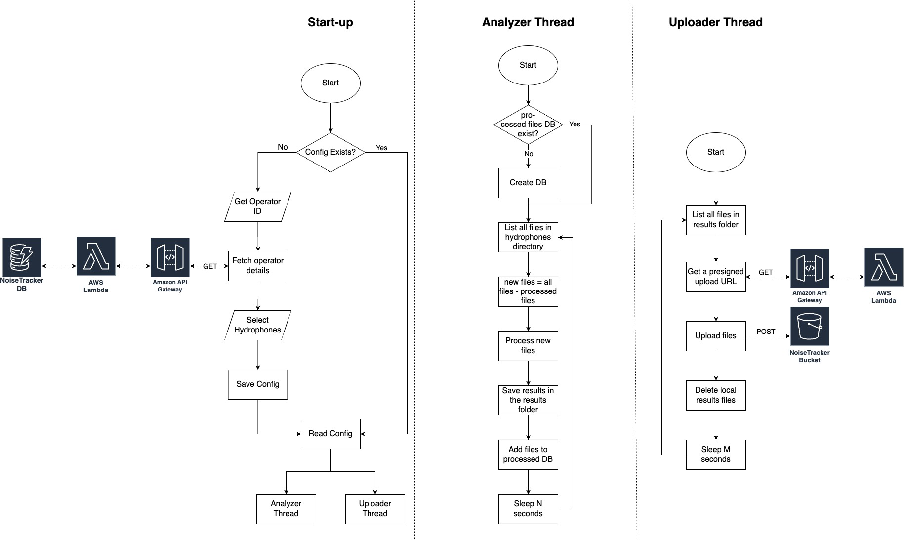

# NoiseTracker Client
The NoiseTracker Client is a desktop application that analyzes audio signals collected from hydrophones and uploads the results to the cloud, where the data is further processed and visualized.
Also check out the [NoiseTracker Web Application](https://github.com/UBC-CIC/noise-tracker-web), which is the centralized information hub for hydrophone operators and members of the general public.
For more information please visit the [CIC Website](https://cic.ubc.ca/).

| Index                                               | Description                                             |
| :-------------------------------------------------- | :------------------------------------------------------ |
| [High Level Architecture](#high-level-architecture) | High level overview illustrating component interactions |
| [Deployment](#deployment-guide)                     | How to deploy the project                               |
| [Directories](#directories)                         | General project directory structure                     |
| [Changelog](#changelog)                             | Any changes post publish                                |
| [Credits](#credits)                                 | Meet the team behind the solution                       |
| [License](#license)                                 | License details                                         |

## High-Level Architecture

The following architecture diagram illustrates the workflow of the client application. For an in-depth explanation of the workflow stages, refer to the [Architecture Deep Dive](docs/ArchitectureDeepDive.md).



## Deployment Guide

To deploy this solution, please follow the steps laid out in the [Deployment Guide](docs/DeploymentGuide.md)

## Directories

```
├── Icon.iconset
├── analyzer
├── uploader
└── docs
```

1. `Icon.iconset`: Contains the icons used in publishing the client application
2. `analyzer`: Contains the components to analyze the audio signals and generate metrics
3. `uploader`: Contains the components to check for new results and upload them to the cloud 
4. `docs`: Contains documentation for the application


## Changelog
N/A

## Credits

This application was architected and developed by Liam Driscoll, Arshia Moghimi, and [Benjamin Hendricks](https://www.soundspaceanalytics.ca/about/biography), with project assistance from Franklin Ma. A special thanks to the UBC Cloud Innovation Centre Technical and Project Management teams for their guidance and support.

## License

This project is distributed under the [MIT License](LICENSE).

Licenses of libraries and tools used by the system are listed below:

[MIT License](LICENSE)

Used Material UI library to design user interface
